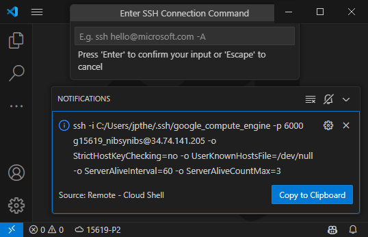

# Remote - Cloud Shell

## Overview

Google Cloud Shell provides instant access to a Debian instance with 5GB of persistent storage and a variety of pre-installed tools.

**Remote - Cloud Shell** is a VS Code extension that enables users to connect to their Google Cloud Shell instance as their remote development environment. It generates SSH commands and configs and integrates these with Remote-SSH configuration.

## Installation

1. Install the extension from the VS Code marketplace.
2. Ensure you have the [**Google Cloud SDK (`gcloud`)**](https://cloud.google.com/sdk/docs/install) installed and authenticated.
3. Install the [**Remote - SSH**](https://marketplace.visualstudio.com/items?itemName=ms-vscode-remote.remote-ssh) extension, which this extension depends on.

## Usage

1. Open VS Code.
2. Use the **Command Palette** (`Ctrl+Shift+P`) to run `Remote-Cloud-Shell: Add ssh ssh host...`
3. Copy the provided SSH command into the input box.
4. Run the `Remote-SSH: Connect to Host` command with your new Google Cloud Shell configuration.

## Troubleshooting

If gcloud is not configured in your PATH environment variable, set the below user setting to the gcloud bin folder.

`"remote-cloud-shell.gcloudPath": "/folder/that/contains/gcloud/tool"`

## License

This project is licensed under the MIT License.
